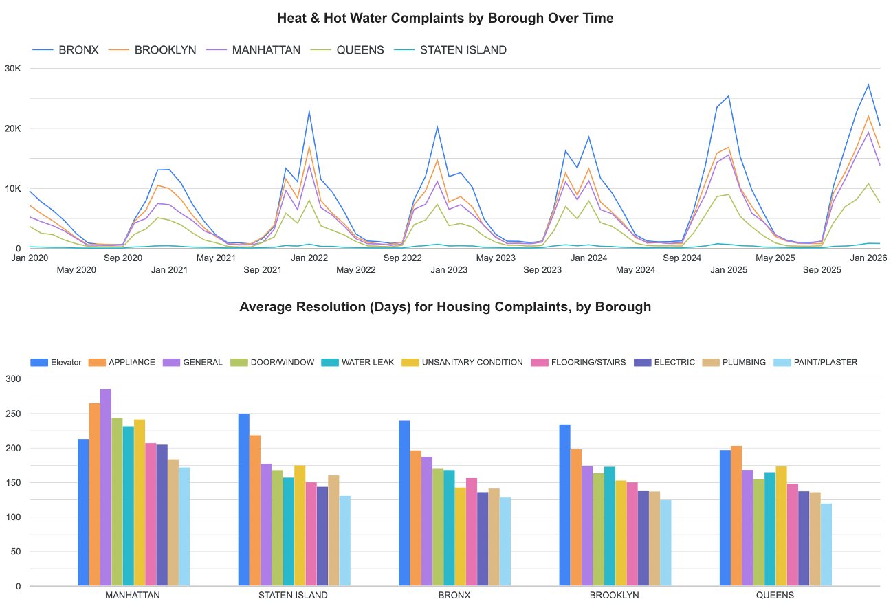
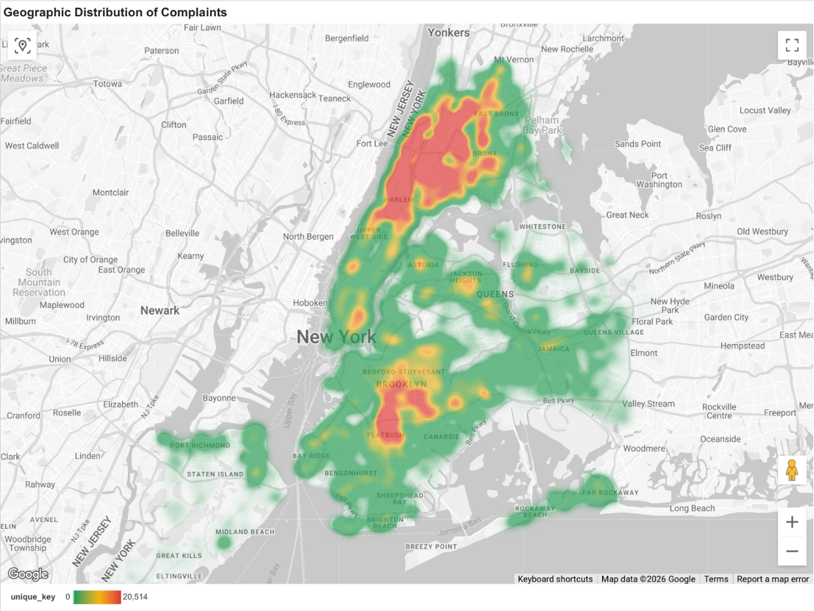

Temporary readme file to note that this project is in-progress and instructions will be uploaded when this project is finalized.

Also while this generally all works, there are parts of some scripts that didn't work and required a manual workaround (e.g., mounting my kestra flow and python script didn't work -- I had to upload those files manually in the kestra interface). 

## Dashboard Test

> 📊 [View Live Dashboard](https://lookerstudio.google.com/reporting/c71e9a02-354d-4846-86e3-af7d35012d9f) 

The dashboard contains 3 tiles:
- **Heat & Hot Water Complaints Over Time** — monthly trend by borough with heat season filter
- **Housing Maintenance Response Times by Borough** — avg resolution days by borough and complaint type
- **Geographic Heatmap** — spatial distribution of housing complaints across NYC

