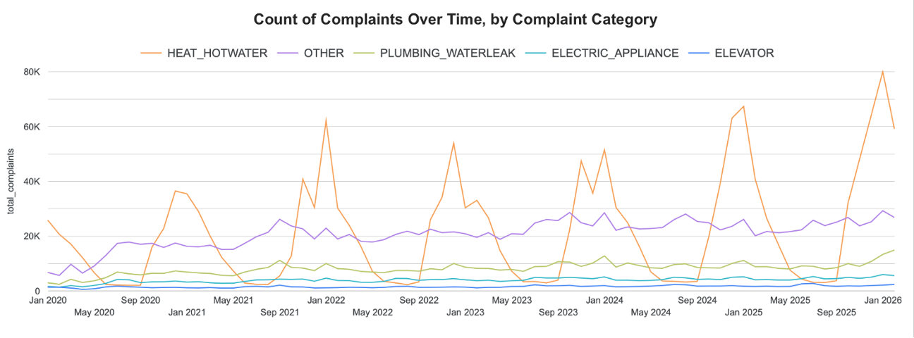
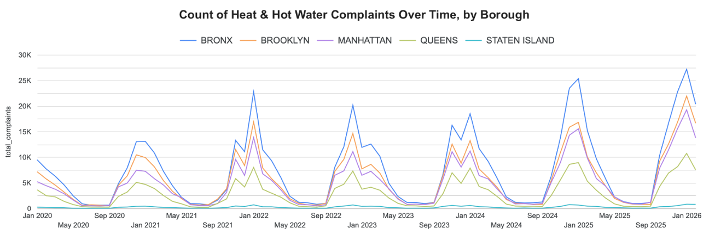
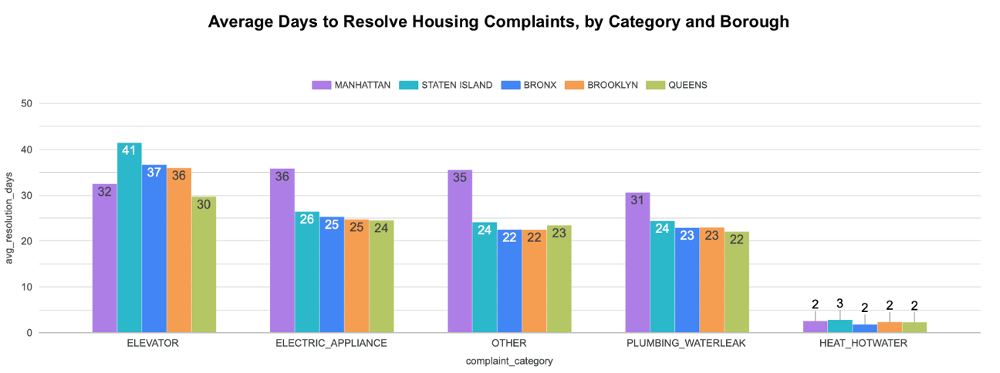
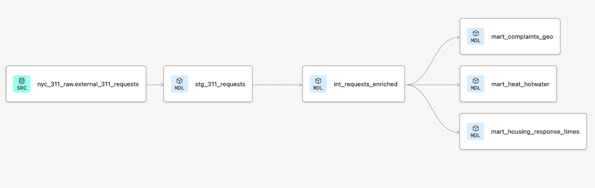
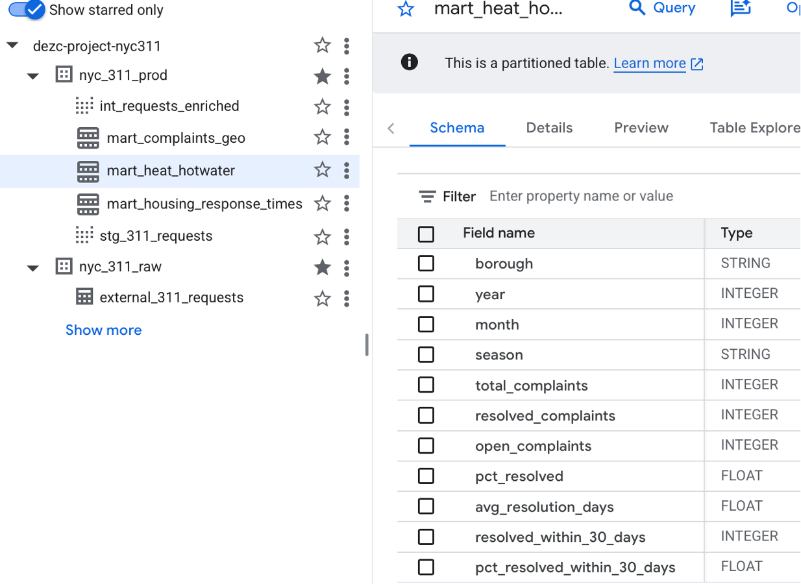

# Housing Maintenance Trends Using NYC 311 Complaints

## About: 

This final project for the 2026 Data Engineering Zoomcamp consists of an end-to-end pipeline analyzing NYC 311 housing-related maintenance complaints from 2020 to present. Given the primary purpose of this project is to demonstrate the ability to build a reproducible data pipeline, the analysis has been kept at a high level.

## Table of Contents
- [Background & Problem Statement](#background--problem-statement)
- [Dashboard](#dashboard)
- [Data Source](#data-source)
- [Pipeline Details](#pipeline-details)
- [Reproducibility](#reproducibility)

---

## Background & Problem Statement

New York City (NYC) is the most populous city in the United States with 8.5 million residents living within the five boroughs (Manhattan, Queens, Bronx, Brooklyn, and Staten Island)[^1]. The NYC 311 system receives hundreds of thousands of housing-related complaints every year. Some of these complaints, such as heat and hot water, tend to be seasonal in nature, rising during the colder months. Other complaints, such as issues with plumbing, interior and electric repairs, elevators, and unsanitary conditions, are less likely to follow a predictable seasonal pattern. 

Given the city's budget deficit,[^2] it is necessary for the city to understand the pattern of housing-related complaints in order to allocate resources efficiently. Additionally, given the vast area that NYC covers (300 square miles over the five boroughs),[^3] the 311 data allows city officials a glance at where complaints are occuring and if there are disparities in the resolution times between the five boroughs.

This project builds a data pipeline to analyze:

1. **Seasonal patterns in housing complaint categories:** Which complaint categories follow a seasonal pattern?
2. **Seasonal patterns in heat & hot water issues, by borough:** Are there differences in the seasonal patterns or number of complaints related to heat & hot water issues by borough? 
3. **Resolution times to housing complaint categories, by borough:** What are the average resolution times to different categories of 311 requests? Are there differences in resolution time by borough?
4. **Geographic heatmap:** What is the spatial distribution of all housing-related complaints across NYC? Are there any notable areas with a high number of complaints?

---

## Dashboard

> 📊 [View Live Dashboard](https://lookerstudio.google.com/reporting/c71e9a02-354d-4846-86e3-af7d35012d9f) 



**Seasonal patterns in housing complaint categories:** 
The first figure displays the number of 311 complaints by complaint category over time. While 'heat / hot water' complaints show a clear seasonal pattern with peaks between the fall and spring months (~September to May), other categories of housing complaints do not show a clear seasonal pattern. 




**Seasonal patterns in heat & hot water issues, by borough:** 
Drilling into heat and hot water complaints, we see the seasonal trend is similar across all five boroughs. Despite the Bronx having the second lowest population of the boroughs,[^4] Bronx residents consistently report the highest number of 311 complaints related to heat and hot water. 

_In a separate analysis of the data,[^5] we see the number of heat and hot water complaints has been steadily increasing over time. The number of complaints in 2025 nearly doubled the number reported in 2020 (315k and 165k, respectively). The city faced an especially harsh winter season at the start of 2026 with two major storms and multiple cold fronts hitting the city. This accounts for the 30k complaint increase in the number of heat and hot water complaints reported in the first two months of 2026 than the prior year._ 




**Resolution times to housing complaint categories, by borough:**
Looking at agency's resolution times to different complaints acorss the five boroughs, there is a noticable difference in the urgency with which agencies respond to heat and hot water complaints (average of 2-3 days across all boroughs) than other categories of complaints. Across electric/appliance and other complaint categories, Manhattan appears to be an outlier with an average resolution time of 10 or more days longer than what residents of the other boroughs experience. On average, plumbing and water leak issues take an additional week in Manhattan compared to other boroughs. Elevator repairs appear to take longer on average across all boroughs (30+ days) compared to other complaint types. 


**Geographic heatmap:**
At a glance, upper Manhattan and the Bronx, along with central parts of Brooklyn (Flatbush, Crown Heights) appear to be sources for a larger number of 311 complaints across NYC. When zooming in on the [Live Dashboard](https://lookerstudio.google.com/reporting/c71e9a02-354d-4846-86e3-af7d35012d9f), there are two very noticable hotspots in the Bronx with a concentration of over 20k complaints over the Jan 2020 - Feb 2026 time period (Tiebout Ave north of E 181st St, and Woodycrest Ave north of W 162nd St.) 


**Take-aways:**
- **Heat and hot water complaints:** Agencies responsible for heat and hot water complaints should structure their resources to meet increased demand during the peak months (Sept - May). At present, these agencies appear to be effectively addressing the heat and hot water issues in a timely manner across all boroughs (average of 2 days). The city may want to investigate the disproportionately high number of complaints reported from Bronx residents.
- **Resolution times across complaint categories:** The city may want to investigate why many housing-related complaints in Manhattan take over a week longer than their counterparts in other boroughs. Additionally, given that elevators are sometimes the only way that residents can accessibly move to and from their apartments, the city may want to look into how to reduce repair times for elevator-related issues.
- **Geographic heatmap:** For future analysis, it would be interesting to look into complaints at the two hotspots identified on the heatmap. Without further analysis, it's unclear if these spots have a large number of different or re-occurring complaints, or a large number 311 requests submitted for the same complaint. 

---

## Data Source

- **Dataset:** [NYC 311 Service Requests from 2020 to Present](https://data.cityofnewyork.us/Social-Services/311-Service-Requests-from-2020-to-Present/erm2-nwe9)
- **Provider:** NYC Open Data (Socrata API)
- **Update frequency:** Daily
  - Note: This project updates on a monthly basis, updating on the 2nd of each month.
- **Columns used:** 19 selected columns: unique_key, created_date, closed_date, complaint_type, descriptor, descriptor_2, resolution_description, location_type, status, agency, borough, incident_zip, community_board, council_district, police_precinct, due_date, city, latitude, longitude
- **Housing complaint types analyzed:** HEAT/HOT WATER, PLUMBING, WATER LEAK, FLOORING/STAIRS, ELECTRIC, APPLIANCE, PAINT/PLASTER, DOOR/WINDOW, UNSANITARY CONDITION, GENERAL, Elevator
- **(Derived Column) Housing complaint categories:** 'HEAT_HOTWATER' (HEAT/HOT WATER), 'PLUMBING_WATERLEAK' (PLUMBING, WATER LEAK), 'ELECTRIC_APPLIANCE' (ELECTRIC, APPLIANCE), 'ELEVATOR' ('Elevator'), 'OTHER' (DOOR/WINDOW, FLOORING/STAIRS, GENERAL, PAINT/PLASTER, UNSANITARY CONDITION)

---

# Pipeline Details

## Architecture

| Layer | Tool | Purpose |
|---|---|---|
| Infrastructure | Terraform | Provisions GCS bucket and BigQuery datasets on GCP |
| Orchestration | Kestra (Docker) | Runs the monthly ingestion pipeline |
| Data Lake | Google Cloud Storage | Stores raw Parquet files partitioned by year/month |
| Data Warehouse | BigQuery | Hosts external raw table and transformed mart tables |
| Transformation | dbt Cloud | Cleans, enriches, and aggregates data into mart tables |
| Dashboard | Looker Studio | Visualizes housing complaint trends and hotspots |

---

## Repo Structure

```
DEZC26_Project/
├── 00_scripts/
│   └── extract_311.py          # Socrata API extractor → GCS
├── 01_terraform/
│   ├── main.tf                 # GCS bucket + BigQuery datasets
│   ├── variables.tf
│   ├── outputs.tf
│   └── terraform.tfvars.example
├── 02_kestra/
│   ├── docker-compose.yml      # Kestra + Postgres containers
│   └── flows/
│       └── nyc_311_ingestion.yml  # Orchestration flow
├── 03_dbt/
│   ├── dbt_project.yml
│   ├── macros/
│   │   └── housing_complaint_types.sql
│   └── models/
│       ├── sources.yml
│       ├── staging/
│       │   ├── stg_311_requests.sql
│       │   └── stg_311_requests.yml
│       ├── intermediate/
│       │   └── int_requests_enriched.sql
│       └── marts/
│           ├── mart_heat_hotwater.sql
│           ├── mart_housing_response_times.sql
│           ├── mart_complaints_geo.sql
│           └── marts.yml
├── .env.example
├── .gitignore
└── README.md
```

---

## Setup Overview:

### GCS

Raw data is stored as Parquet files in GCS with Hive-style partitioning:
```
gs://nyc-311-dezc-project-2026/nyc_311/
  year=2020/month=01/data.parquet
  year=2020/month=02/data.parquet
  ...
  year=2026/month=02/data.parquet
```

### dbt Lineage



The dbt project follows a three-layer architecture:
- **Staging** (`stg_311_requests`) — type casting, deduplication, borough standardization
- **Intermediate** (`int_requests_enriched`) — derives `resolution_days`, `is_resolved`, `resolved_within_30_days`, `time_of_day`, `complaint_category`
- **Marts** — 3 focused tables for the 4 dashboard tiles, all filtered to housing complaint types.


### BigQuery
Two datasets in BigQuery:
- `nyc_311_raw` — external table pointing at GCS Parquet files
- `nyc_311_prod` — dbt-managed transformed tables (staging views + mart tables)

The external table uses Hive partitioning (`year=YYYY/month=MM`) for efficient time-range queries.

BigQuery tables are partitioned and clustered to optimize query performance and reduce costs:

| Table | Partitioned by | Clustered by | Reason |
|---|---|---|---|
| `mart_heat_hotwater` | `year` (int range) | `borough`, `month` | Most queries filter by time and borough |
| `mart_housing_response_times` | `year` (int range) | `borough`, `complaint_category` | Analysis dimensions are borough and complaint category |
| `mart_complaints_geo` | `year` (int range) | `borough`, `complaint_type` | Map tile queries filtered by year and complaint type |

---

# Reproducing This Project 

## Overview:
- **Terraform** is used to provision the cloud infrastructure on GCP: creates a GCS bucket (the data lake) and two BigQuery datasets (nyc_311_raw, nyc_311_prod).
- **Kestra**, running locally via Docker, orchestrates the data pipeline: It executes extract_311.py which pulls NYC 311 service request data from the Socrata API month by month, converts it to Parquet files, and uploads them to GCS partitioned by year and month. Kestra then creates a BigQuery external table in nyc_311_raw that points directly at those Parquet files in GCS, making the raw data queryable without loading it into BigQuery storage. 
- **dbt Cloud** connects to BigQuery and runs the transformation layer: A staging model cleans and casts the raw data, an intermediate model enriches it with derived fields like resolution time and complaint flags, and three mart models aggregate the data into analysis-ready tables in nyc_311_prod.
- **Looker Studio** connects directly to the mart tables in BigQuery to power a dashboard with three tiles analyzing heat and hot water failure patterns, housing maintenance response times, and a geographic heatmap of housing complaints across NYC.

### Prerequisites
- GCP account with billing enabled
- Terraform >= 1.0
- Docker Desktop
- dbt Cloud account (free tier)
- Socrata app token

The following steps assume that you are starting from scratch and do not have accounts set up.

## Step 1: Clone the repo
```bash
git clone https://github.com/your-username/DEZC26_Project.git
cd DEZC26_Project
```

## Step 2: Obtain Socrata app token for NYC Open Data
1. Go to https://data.cityofnewyork.us and sign in or create a free account
2. Click your profile icon (top right) -> Developer Settings
3. Click Create New App Token
4. Fill in any app name (e.g., DEZC_project_311data) and description and click Save. _It doesn't matter what you put as it's just for your own reference._ 
1. Your app token will appear on the next screen. Copy the token and paste it as the value for SOCRATA_APP_TOKEN in your .env file. The token is just a string of random characters, something like aBcDeFgH1234567.

## Step 3: Set up GCP
1. Create a new GCP project: DEZC-Project-NYC311
2. Create a new service account: 
   1. In IAM & Admin --> Service Accounts. Create a new service account and give it the following roles: BigQuery Admin, Storage Admin, and Viewer. 
   2. Click on the service account --> Manage Keys --> Add Key --> Create new key --> JSON. Save the key file.
3. In APIs & Services --> Enable APIs. Enable:
   1. Cloud Storage API (Need to run extract_311.py and for Terraform to create buckets and upload Parquet files.)
   2. BigQuery API (Terraform needs to create datasets and tables. dbt needs to run transformations.)
   3. Compute Engine API (Terraform's GCP provider requires it to be enabled as a baseline dependency, regardless of intent to use virtual machines.) 
   4. IAM API: Identity & Access Management. (Terraform needs this enabled to assign roles to the service account.)
4. If you haven't already, install the GCP CLI (gcloud) locally from https://cloud.google.com/sdk/docs/install. Then run `gcloud init` & follow the prompts to log in and select your project 

## Step 4: Configure environment variables
```bash
cp .env.example .env
# Fill in your values:
# SOCRATA_APP_TOKEN=...
# GCP_PROJECT_ID=...
# GCS_BUCKET_NAME=...
# GOOGLE_APPLICATION_CREDENTIALS=...
```

## Step 5: Provision infrastructure with Terraform
1. If you haven't already, install Terraform from https://developer.hashicorp.com/terraform/install. Verify it works: `terraform --version`
2. Navigate to the '01_terraform/' folder
2. In terminal, run `cp terraform.tfvars.example terraform.tfvars` to create the 'terraform.tfvars' file. Fill in the variable values for credential_file, project_id, and create a unique gcs_bucket_name. 
3. Run `terraform init` to initialize terraform (downloads the GCP provider)
4. Run `terraform plan` to preview what will be created
5. Run `terraform apply` to create the resources. Follow prompt to write 'yes' to complete the action. 
6. After you complete this, in GCP navigate to Cloud Storage --> Buckets to confirm the bucket was created. Navigate to BigQuery --> Studio to see the datasets. 
7. Go to your '.env' file in the root directory and update your 'GCP_BUCKET_NAME'.

**Summary**
```bash
cd 01_terraform   
cp terraform.tfvars.example terraform.tfvars  

terraform init
terraform plan
terraform apply
cd ..
```

**Terraform Files**
1. 'main.tf' provides the infrastructure and defines 3 resources:
   1. one GCS bucket (the data lake)
   2. two BigQuery datasets ('nyc_311_raw' and 'nyc_311_prod')
      1. Note: The buckets have a 90-day auto-delete lifecylce rule as a cost-protection measure.
2. 'variables.tf' defines the input variables so that nothing is hardcoded. Sensitive values like credentials stay out of the code.
3. 'outputs.tf' print the created resource names and URLs to the terminal after running `terraform apply`. This confirms everything was created correctly.
4. 'terraform.tfvars.template' is a template used to create 'terraform.tfvars', which contains values that will NOT be committed to git ('*.tfvars' is in .gitignore).


## Step 6: Setup Kestra to load the flow and backfill the data

### 6A. Docker
You will need Docker to run Kestra. 
1. To get Docker Desktop, go to https://www.docker.com/products/docker-desktop/ and follow the instructions for download. 
2. Open Docker Desktop so that it is running.
3. To verify it works, run in terminal:
   1. `docker --version`
   2. `docker run hello-world`. If you see "Hello from Docker!" in the output, you are good to go.

### 6B. Set up secret keys in Kestra
1. Encode your GCP service account key: Run the following command from your project root (where the '.env' file lives), replacing the path with the actual path to your JSON key:
   1. On mac: `echo SECRET_GCP_SERVICE_ACCOUNT=$(cat /path/to/your/service-account-key.json | base64) >> .env_encoded`
   2. On windows (note: I did not test this): `echo SECRET_GCP_SERVICE_ACCOUNT=$(cat /path/to/your/service-account-key.json | base64 -w 0) >> .env_encoded`
2. Add your other secrets to .env_encoded by running the following commands after updating the placeholders. _Note: the following commands are for mac. Use the example above to adjust for Windows._
   1. Add your Socrata App Token: `echo SECRET_SOCRATA_APP_TOKEN=$(echo -n "your_socrata_token_here" | base64) >> .env_encoded`
   2. Add your GCS Bucket Name: `echo SECRET_GCS_BUCKET_NAME=$(echo -n "your-bucket-name-here" | base64) >> .env_encoded`
   3. Add your GCP Project ID: `echo SECRET_GCP_PROJECT_ID=$(echo -n "your-gcp-project-id" | base64) >> .env_encoded`
3. Add '.env_encoded' to '.gitignore' to prevent it from being published. Open your '.gitignore' and add this line under the '#Environments' section: `.env_encoded`

**Summary**
```bash
# Encode secrets for Kestra
echo SECRET_GCP_SERVICE_ACCOUNT=$(cat /path/to/service-account.json | base64) >> .env_encoded
echo SECRET_SOCRATA_APP_TOKEN=$(echo -n "your_token" | base64) >> .env_encoded
echo SECRET_GCS_BUCKET_NAME=$(echo -n "your_bucket_name" | base64) >> .env_encoded
echo SECRET_GCP_PROJECT_ID=$(echo -n "your_project_id" | base64) >> .env_encoded
```

### 6C. Start Kestra
1. Navigate to '02_kestra/' folder.
2. Run `docker-compose up -d`
3. Open http://localhost:8080 in your browser to view Kestra. Use the username and password in 'docker-compose.yml' under the 'kestra' service to login. 

### 6D. Load flow & extract script
1. Go to Flows and see if the 'nyc_311_ingestion' flow is already loaded. If it is not, click Create (top right) and paste the contents of 'nyc_311_ingestion.yml' directly into the editor (replace the default text). Click Save. 
2. Manually upload the 'extract_311.py' file into Kestra's namespace files. 
   1. In the Kestra UI, go to Namespaces (left sidebar) --> Click on 'nyc_311' namespace --> Namespace Files tab --> Upload the 'extract_311.py'. This will store it in Kestra directly. 

### 6D. Backfill data
1. Test a single month (2020, month 1) of the flow by navigating to the flow --> Execute --> set 'year=2020' and 'month=1' to test a single month. 
   1. It should run in about 1-2 minutes and show a successful upload with 195,231 files feteched.
   2. Do not worry about the red 'ERROR' badges. Those are how Kestra displays Python's standard logging output (INFO level logs from the script) -- they are not actual errors. 
2. . Check GCS to verify the Parquet file landed at 'nyc_311/year=2020/month=01/data.parquet'. 
3. Check BigQuery to verify the external table 'nyc_311_raw' was created. 
   1. Go to BigQuery --> Studio. You should see the 'external_311_requests' table under the 'nyc_311_raw'.
   2. Run a query to confirm row counts (replace 'your-gcp-project-id' first): 
   ```
   SELECT COUNT(*) FROM `your-gcp-project-id.nyc_311_raw.external_311_requests`
   ```
   (20,352,481 rows)
4.  If the parquet file is available and the BigQuery table was created, run the full backfill. [This took me about 70 minutes]
   1. Go to 'nyc_311_ingestion' flow
   2. Click 'Execute'
   3. Leave 'year' and 'month' inputs blank (this triggers the backfill mode in the script)
   4. Click 'Execute' to confirm. At that point, Kestra will run 'extract_311.py' from January 2020 to the last completed month and upload each file to GCS. 
   5. Notes:
      1. You can watch progress in the Kestra UI under Executions --> click into the running executions --> Logs
      2. If the backfill fails partway through, you can rerun just the failed month using the single month mode (`--year YYYY --month MM`) without rerunning everything.
      3. If you rerun the flow for a month, it will overwrite the existing file (you will not have duplicate files in GCS). 

### (Option) 6E. Set up monthly trigger
1.  After the backfill is successful, change the monthly schedule trigger in 'nyc_311_ingestion'. Set it from `disabled: true` to `disabled: false`. This enables the monthly schedule to activate and fire on the 2nd of each month at 6am UTC going forward. 

**Kestra Files**
There are 2 files in 02_kestra/: 
1. 'docker-compose.yml' creates two containers:
   1. Postgres (Kestra's backend database)
   2. Kestra
2. 'nyc_311_ingestion.yml' is a file under '02_kestra/flows/' with 3 tasks and 2 run modes:
   1. Tasks:
      1. Task 1 (`extract_and_upload`): fetches data from the Socrata API and uploads Parquet files to GCS
      2. Task 2 (`create_external_table`): creates or replaces the BigQuery external table pointing at the GCS data
      3. Task 3 (`log_success`): logs completion details
   2. Modes:
      1. Mode 1 - Backfill mode: runs with no inputs, processes all months from January 2020 to the last completed month
      2. Mode 2 - Single month mode: passes `year` + `month` inputs, great for testing or reruns
         1. The monthly schedule trigger was initially set to `disabled: true` — enable it (set to `false`) once the backfill is complete.


## Step 7: Set up dbt Cloud
Note: If you already have an account and a project in dbt Cloud under a solo developer (free) account, you will need to delete the existing project and update the BigQuery connection JSON file. 

1. Create a free account at [cloud.getdbt.com](https://cloud.getdbt.com)
   1. Name the new project: nyc-311-de-project
2. Connect BigQuery
   1. When prompted to connect a data warehouse, select BigQuery. (This can also be found under 'Development connection' under your Project details)
   2. It will ask for your service account JSON key — upload the same .json file you used for Terraform/Kestra
   3. Set the dataset to 'nyc_311_prod' — this is where dbt will write its output tables
   4. Leave the defaults for 'Target name' (default) and 'Threads' (6). 
   5. Click Test Connection to verify it works. 
   6. Click Save.
3. Connect your GitHub repo
   1. When prompted to connect a repository, select GitHub
   2. Authorize dbt Cloud to access your GitHub account
   3. Select your repo for this project 
   4. Under 'Project details' click 'Edit' and set the project subdirectory to '03_dbt' — this tells dbt Cloud where your dbt project lives inside the repo.
4. Initialize the dbt project
   1. In dbt Cloud, go to Studio (top left)
   2. Before you initialize, make sure the previous files and your '03_dbt' folder are synced to the main branch in Github. dbt Cloud will need the '03_dbt' folder present to initialize in the next step. _(I ran into issues when I did not have the folder already present)_
   3. Click 'Initialize dbt project' — this creates the default folder structure inside '03_dbt' or identifies the existing structure. dbt will also create a lot of template files in the 03_dbt folder. 
      1. Delete the 'example' folder and its contents under 'models'
      2. If the dbt_project.yml contains an "example" line, delete it.
      3. Open the root '.gitignore' and add '03_dbt/target/'
5. Navigate to Orchestration (left-hand nav) --> Environments --> Environmental variables. Create a key 'DBT_PROJECT_ID' and put the GCP Project ID in the 'Project Default' and 'Development', then click Save. 
6. In dbt studio, run `dbt run`. After these run successfully, you can go into BigQuery and see these tables appear in dezc-project-nyc311 --> nyc_311_prod. 
7. In dbt studio, run `dbt test` to run the tests. 

**Screenshot of BigQuery after running `dbt run`:**


**dbt files** 
- **dbt_project.yml** is the main config file. It sets the project name (nyc_311), tells dbt where to find models/macros/tests, and defines the materialization strategy for each layer.
- **macros/housing_complaint_types.sql** is a reusable macro that returns the list of 11 housing complaint types. 
- **models/sources.yml** registers the BigQuery external table (external_311_requests) as a dbt source so models can reference it with {{ source() }} instead of hardcoded table names.
- **models/staging/**
  - **stg_311_requests.sql** is the first transformation layer. Deduplicates rows by unique_key, casts all columns to proper types (Socrata returns everything as strings), standardizes columns, uses regex to safely extract numeric values from messy council_district and police_precinct fields, and filters out rows with null keys, null dates, or invalid boroughs.
  - **stg_311_requests.yml** defines column descriptions and data quality tests for the staging model — including unique and not_null on unique_key, and accepted_values tests on status and borough.
- **models/intermediate/**
  - **int_requests_enriched.sql** is the enrichment laywer that derives five new fields from the staging columns: 'complaint_category', 'resolution_days', 'is_resolved', 'time_of_day', and 'day_of_week'. 
- **models/marts/**
  - **marts.yml** defines column descriptions and data quality tests for all 3 mart tables, including not_null, unique, and accepted_values tests on key columns.
  - **mart_heat_hotwater.sql** aggregates `HEAT/HOT WATER` complaints  by borough, year, month, and season (heat season Oct–May, vs non-heat season). Outputs complaint volume, resolution rate, and avg resolution days per group. Powers the heat & hot water trend tile in Looker Studio.
  - **mart_housing_response_times.sql** aggregates all 11 housing complaint types by borough, complaint type, and year. Outputs total complaints, resolved complaints, avg resolution days, median resolution days, and pct resolved within 30 days. Powers the response times tile in Looker Studio.
  - **mart_complaints_geo.sql** filters to housing complaints with valid NYC coordinates (bounding box check). Outputs one row per complaint with latitude, longitude, complaint type, borough, community board, and resolution details. Powers the geographic heatmap tile in Looker Studio.


## Step 8: Connect Looker Studio
1. Sign into [lookerstudio.google.com](https://lookerstudio.google.com) with the same google account you use for GCP. 
2. Create a new report:
   1. Click Create --> Report
   2. Add a data source: Select 'BigQuery'
   3. Authorize Looker Studio to access your GCP account if prompted 
3. Add your data sources. You will need to all 3 mart tables as data sources. For the first one:
   1. Select My Projects --> [your project name] --> nyc_311_prod
   2. Select 'mart_complaints_by_borough'
   3. Click Add --> Add to Report
   4. It will navigate you to the report page. From there, you can click 'Add Data' at the bottom and repeat the process above for the remaining 3 marts
4. Build the tiles. _I am not including detailed instructions on how to create tiles in Looker. Claude was mostly useful for instructions but not always accurate._

---

## Shutting Down the Project
When you no longer need this project active, do the following to reduce your resource use and billing:
1. **Stop Kestra (Docker).** From inside the '02_kestra/' folder in your terminal, run `docker-compose down`. This stops and removes Kestra and Postgres containers. _This does not delete anything in GCS or BigQuery._
2. **Stop Docker Desktop.** Quick Docker Desktop
3. **No actions needed for**
   1. **dbt Cloud.** dbt Cloud is a web service and there is nothing running locally to shut down. Just close the browser tab. _If you are on the free plan and need to use dbt Cloud for a new project, you will need to delete this project._
   2. **Looker.** Just close the browser tab.
4. **GCS and BigQuery.** 
   1. **To keep the data:** If you want to keep the data in GCS and BigQuery, there is nothing you need to do. Be aware that there are charges associated, but these are minimal (~$0.02/GB/month in each).
   2. **To avoid charges:** To shut down GCP entirely, navigate to '01_terraform/' in the terminal and run `terraform destroy` --> type 'Yes' when prompted. This will delete the GCS bucket, all parquet files inside it, and both BigQuery datasets. 


---

## Future improvements:
- **Kestra**: Ideally the 'nyc_311_ingestion' flow would identify the 'extract_311.py' script and be able to run it without having to load the 'extract_311.py' file into Kestra Namespaces. A future improvement would fix the location issue and prevent the need to manually load the 'extract_311.py' file. 
  - The two mounts that were set up but did not work inside of 'docker-compose.yml' 
      1. ./flows: Intended for Kestra to watch this folder and auto-load any flow YAMLs it finds
      2. ./scripts: Intended to make 'extract_311.py' available inside the container at /scripts/

---

## Related Readings & References 
- [NYC Comptroller — Turn Up the Heat: 2025 Update](https://comptroller.nyc.gov/reports/turn-up-the-heat-2025-update/)
- [City Limits — No Heat Complaints Hit New Highs](https://citylimits.org/no-heat-complaints-in-nyc-apartments-hit-new-highs-last-year-heres-how-to-get-help/)
- [Violation Watch — NYC 311 Complaints Housing](https://violationwatch.nyc/nyc-311-complaints-housing/)

[^1]:[Wikipedia - New York City](https://en.wikipedia.org/wiki/New_York_City)
[^2]:[NYS Comptroller - NYC Budget Reveals Structural Gaps](https://www.osc.ny.gov/press/releases/2026/03/dinapoli-nyc-budget-increases-transparency-reveals-structural-gaps)
[^3]:[Wikipedia - New York City](https://en.wikipedia.org/wiki/New_York_City)
[^4]:[Wikipedia - Boroughs of NYC](https://en.wikipedia.org/wiki/Boroughs_of_New_York_City)
[^5]: Calculated through data queried in the NYC 311 data: `SELECT year, month, SUM(total_complaints) as tot_complaints_per_year FROM ``dezc-project-nyc311.nyc_311_prod.mart_heat_hotwater`` GROUP BY year, month ORDER BY year DESC, month DESC`